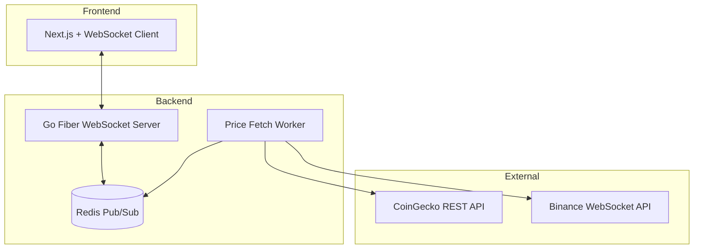
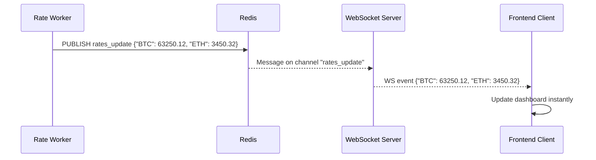

# ⚡ Real-Time Crypto Rates System (WebSocket + Redis)

**Project:** Crypto Wallet & Transaction Aggregator  
**Purpose:** Enable live price updates for BTC, ETH, SOL, and XLM via WebSocket streams.

---

## 🧩 Overview

This document describes the WebSocket-based real-time price update system for the project.  
It enables the frontend dashboard to reflect live price movements without reloading or polling.

---

## ⚙️ Architecture Diagram



---

## 🧱 Components

### 1. **Rate Worker (Fetcher)**  
Fetches prices from external APIs (CoinGecko, Binance) periodically and publishes to Redis.

**Responsibilities:**
- Pull latest prices for BTC, ETH, SOL, XLM
- Push to Redis cache (`rates:{symbol}`)
- Publish event to Redis channel `rates_update`

**Example Code:**
```go
package worker

import (
    "context"
    "encoding/json"
    "net/http"
    "time"
    "github.com/redis/go-redis/v9"
)

type Rate struct {
    BTC float64 `json:"BTC"`
    ETH float64 `json:"ETH"`
    SOL float64 `json:"SOL"`
    XLM float64 `json:"XLM"`
}

func StartRateWorker(rdb *redis.Client) {
    ctx := context.Background()
    ticker := time.NewTicker(5 * time.Second)

    for range ticker.C {
        rates := fetchRates()
        data, _ := json.Marshal(rates)
        rdb.Publish(ctx, "rates_update", data)
    }
}

func fetchRates() Rate {
    resp, _ := http.Get("https://api.coingecko.com/api/v3/simple/price?ids=bitcoin,ethereum,solana,stellar&vs_currencies=usd")
    defer resp.Body.Close()

    var data map[string]map[string]float64
    json.NewDecoder(resp.Body).Decode(&data)

    return Rate{
        BTC: data["bitcoin"]["usd"],
        ETH: data["ethereum"]["usd"],
        SOL: data["solana"]["usd"],
        XLM: data["stellar"]["usd"],
    }
}
```

---

### 2. **WebSocket Server (Broadcaster)**  
Listens to Redis Pub/Sub messages and broadcasts to all connected WebSocket clients.

**Responsibilities:**
- Handle `/ws/rates` WebSocket endpoint
- Subscribe Redis channel `"rates_update"`
- Broadcast messages to clients in real-time

**Example Code:**
```go
package websocket

import (
    "context"
    "github.com/gofiber/contrib/websocket"
    "github.com/redis/go-redis/v9"
)

var ctx = context.Background()

func NewRatesWSHandler(rdb *redis.Client) fiber.Handler {
    return websocket.New(func(c *websocket.Conn) {
        pubsub := rdb.Subscribe(ctx, "rates_update")
        defer pubsub.Close()

        for msg := range pubsub.Channel() {
            c.WriteMessage(websocket.TextMessage, []byte(msg.Payload))
        }
    })
}
```

---

### 3. **Frontend (Next.js WebSocket Client)**

**Responsibilities:**
- Connect to WebSocket endpoint (`ws://api:8080/ws/rates`)
- Listen for live updates and render in dashboard
- Update UI state in real-time

**Hook Example:**
```tsx
"use client";
import { useEffect, useState } from "react";

export default function useLiveRates() {
  const [rates, setRates] = useState<any>({});

  useEffect(() => {
    const ws = new WebSocket("ws://localhost:8080/ws/rates");
    ws.onmessage = (event) => {
      const data = JSON.parse(event.data);
      setRates(data);
    };
    return () => ws.close();
  }, []);

  return rates;
}
```

**UI Example:**
```tsx
"use client";
import useLiveRates from "@/app/hooks/useLiveRates";

export default function Dashboard() {
  const rates = useLiveRates();
  return (
    <div className="p-6">
      <h1 className="text-2xl font-semibold mb-4">📊 Live Crypto Prices</h1>
      <div className="grid grid-cols-2 gap-4">
        {Object.entries(rates).map(([coin, price]) => (
          <div key={coin} className="p-4 rounded-lg bg-slate-800 text-white">
            <h2 className="text-lg">{coin}</h2>
            <p className="text-2xl">${price}</p>
          </div>
        ))}
      </div>
    </div>
  );
}
```

---

## 🔄 System Flow



---

## 🧰 Environment Variables

Add these to `.env` for WebSocket + Worker integration:
```bash
# Redis Config
REDIS_HOST=redis
REDIS_PORT=6379
REDIS_PASSWORD=
REDIS_CHANNEL=rates_update

# Worker Interval (seconds)
RATES_REFRESH_INTERVAL=5

# External APIs
COINGECKO_API_URL=https://api.coingecko.com/api/v3/simple/price
SUPPORTED_COINS=bitcoin,ethereum,solana,stellar
```

---

## 🧱 Folder Structure Example

```bash
backend/
├── internal/
│   ├── websocket/
│   │   └── rates.go
│   ├── worker/
│   │   └── rate_worker.go
│   ├── infrastructure/
│   │   └── redis_client.go
│   └── interfaces/
│       └── http/
│           └── routes.go
└── cmd/
    └── server/
        └── main.go
```

---

## 🚀 Expected Result

- Dashboard shows real-time updates for crypto prices (BTC, ETH, SOL, XLM)
- Prices auto-refresh every 5 seconds (or faster if configured)
- Redis broadcasts changes instantly to all clients
- Multiple users can view real-time prices concurrently

---

## 📈 Optional Enhancements

| Feature | Description |
|----------|--------------|
| **Frontend Chart Integration** | Use Recharts or ApexCharts to show live line graphs |
| **Historical Caching** | Store last 50 updates in Redis for trends |
| **WebSocket Auth** | Add JWT auth header before WS connection |
| **Exchange Fallback** | Use Binance WebSocket as backup if CoinGecko fails |
| **Worker Scaling** | Run multiple workers (Docker scale) subscribing to same Redis |

---

## ✅ Summary

This design enables a production-ready real-time rate update system with minimal overhead using:
- **Go Fiber** for WebSocket server  
- **Redis Pub/Sub** for broadcast events  
- **CoinGecko API** for price data  
- **Next.js (App Router)** frontend for live dashboard  

No gRPC required — simple, lightweight, and scalable ⚡
