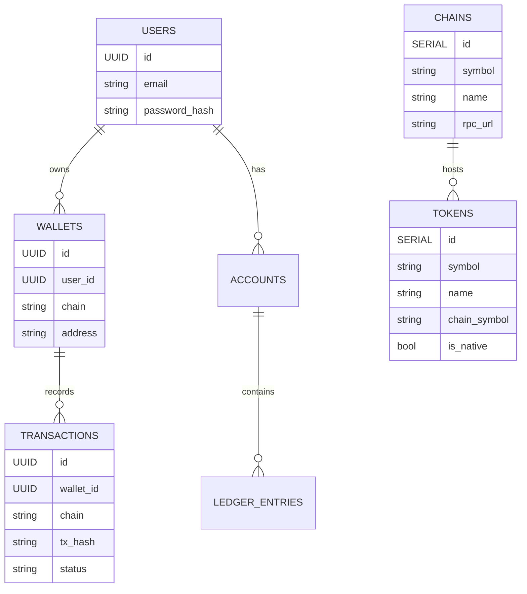
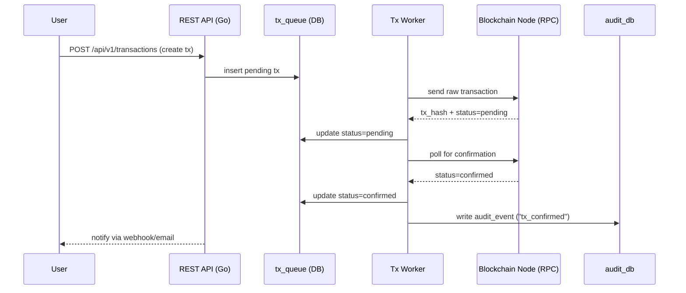
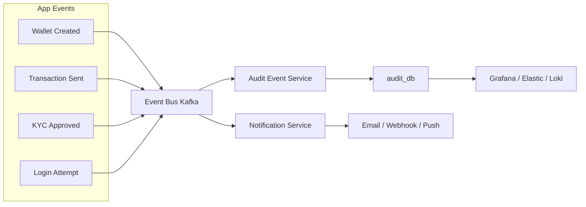
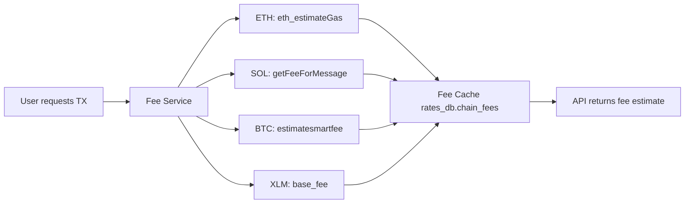
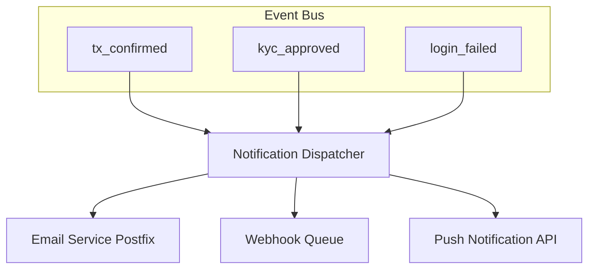
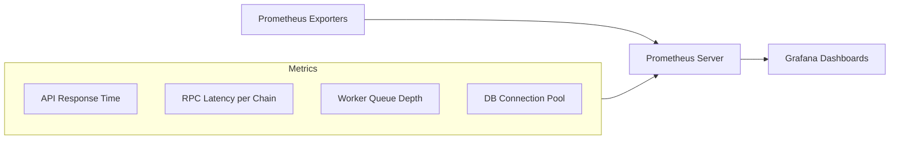

# 🧱 Full System Architecture --- Crypto Wallet & Transaction Aggregator

> **Architecture Blueprint** for a complete Fintech-grade multi-chain
> wallet system\
> Supporting Bitcoin (BTC), Ethereum (ETH), Solana (SOL), and Stellar
> (XLM)

This document provides a **Mermaid-based architecture overview**
covering all layers: Core System, Blockchain Layer, Workers, KYC,
Security, and Monitoring.

---

## 🧭 1. High-Level System Overview

```mermaid
flowchart LR
    A[Frontend: Next.js Wallet Dashboard] -->|REST API| B[Backend: Go Application Layer]
    B --> C1[core_db]
    B --> C2[kyc_db]
    B --> C3[rates_db]
    B --> C4[audit_db]

    subgraph Blockchain Layer
      B --> D1[BTC Adapter (btcd RPC)]
      B --> D2[ETH Adapter (go-ethereum RPC)]
      B --> D3[SOL Adapter (solana-go-sdk RPC)]
      B --> D4[XLM Adapter (stellar/go REST)]
    end

    subgraph External Services
      B --> E1[CoinGecko API]
      B --> E2[Binance API]
      B --> E3[Vault/KMS for Key Encryption]
    end

    B --> F[Event Bus (Kafka/NATS)]
    F --> G1[Tx Queue Worker]
    F --> G2[Audit Event Service]
    F --> G3[Notification Service]

    subgraph Analytics & Monitoring
      H1[Prometheus] --> H2[Grafana Dashboard]
      H3[Audit DB Logs] --> H2
    end

    G1 --> B
    G2 --> C4
    G3 --> A
```

---

## 🪙 2. Core Database Relationships



---

## 🔄 3. Transaction Lifecycle (Queue & Worker)



---

## 🔐 4. Key Management & Encryption Flow

```mermaid
flowchart TD
    A[User creates Wallet] --> B[Backend generates Keypair]
    B --> C[Encrypt with AES-GCM / Secretbox]
    C --> D[Store in core_db (encrypted_private_key)]
    D --> E[Vault / KMS Key]
    E -->|Decrypt on-demand| B2[Blockchain Adapter]
    B2 --> F[Send Transaction (Signed)]
```

🧠 Notes: - Each private key is encrypted **before DB storage** -
Decryption only occurs in memory (transient usage) - Optional: Use
HashiCorp Vault or AWS KMS for key material

---

## 🧾 5. Event-Driven Logging & Audit Trail



✅ Benefits: - Asynchronous & scalable logging\

- Immutable audit trails (append-only)\
- Real-time event notifications

---

## 💱 6. Liquidity & Exchange Flow

```mermaid
flowchart TD
    A[Exchange Service] --> B1[Rate Provider (CoinGecko)]
    A --> B2[Trading Pairs (rates_db)]
    A --> B3[Wallet Balance Checker]
    A --> C1[Internal Swap Engine]
    A --> C2[DEX Adapter (Uniswap / Stellar DEX)]

    C1 --> D1[Update ledger_entries]
    C2 --> D2[Submit on-chain swap transaction]
    D1 --> E[rates_db]
    D2 --> F[audit_db]
```

🧩 Supports both: - **Off-chain Swap** (internal matching / balance
update)\

- **On-chain Swap** via DEX adapters

---

## ⛽ 7. Gas Fee Estimation Layer



---

## 🔔 8. Notification Layer (Webhook / Email)



📬 Notification Types: - Transaction confirmations\

- Security alerts\
- Compliance updates\
- System health notifications

---

## 📊 9. Analytics & Monitoring



🧠 Includes: - Wallet usage statistics\

- Transaction volumes (from `rates_db.transaction_summary`)\
- Blockchain latency per chain\
- KYC completion rates\
- Alert frequency (from `audit_db`)

---

## ✅ Summary of All Components

Layer Purpose

---

**Frontend** Wallet dashboard (Next.js + Tailwind + TypeScript)
**Backend** Go Fiber/FastHTTP API layer (DDD + Hexagonal)
**Blockchain Layer** Multi-chain RPC (BTC, ETH, SOL, XLM)
**Database Layer** PostgreSQL ×4 (core, kyc, rates, audit)
**Workers** Tx Queue, Fee Estimator, Rate Updater
**Security Layer** AES-GCM encryption, Vault KMS, JWT Auth
**Event Bus** Kafka/NATS for async event flow
**Analytics Layer** Prometheus + Grafana for metrics
**Notifications** Email, Webhook, Push integration

---

**This design achieves:**\
✅ Multi-chain wallet infrastructure (BTC / ETH / SOL / XLM)\
✅ Secure custody with encrypted private keys\
✅ Real-time event-driven logging\
✅ Scalable transaction lifecycle (queue + worker)\
✅ Cross-chain swap extensibility\
✅ Compliance-ready architecture (KYC + AML separation)

---
