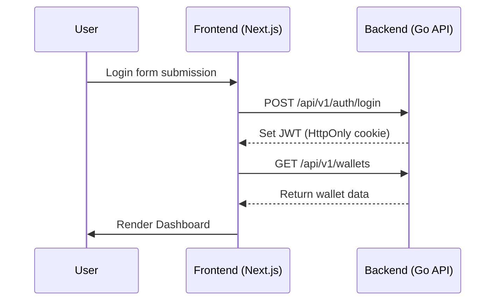

# 🎯 Project Goal

Build a **Next.js 15 (App Router) + TypeScript frontend** for a **Crypto Wallet & Transaction Aggregator** system that integrates with a Go backend via REST API.

The frontend should serve as a multi-chain wallet dashboard for BTC, ETH, SOL, and XLM, supporting balance visualization, transactions, swapping, KYC, and notifications.

---

## 💻 1. Framework & Stack

| Category             | Library                        | Purpose                                  |
| -------------------- | ------------------------------ | ---------------------------------------- |
| **Framework**        | Next.js 15 (App Router)        | Modern React-based full-stack framework  |
| **Language**         | TypeScript                     | Type-safe and maintainable               |
| **UI System**        | TailwindCSS + ShadCN/UI        | Beautiful, modular components            |
| **Animation**        | Framer Motion                  | Smooth transitions                       |
| **Charts**           | Recharts                       | For analytics (balance, rates, activity) |
| **Form Validation**  | React Hook Form + Zod          | Robust validation system                 |
| **State Management** | Zustand                        | Lightweight global state store           |
| **API Layer**        | Axios                          | REST communication with Go backend       |
| **Auth**             | JWT via HttpOnly Cookie        | Secure session handling                  |
| **Notifications**    | ShadCN Toast / React Hot Toast | Real-time alerts                         |
| **i18n**             | next-intl                      | English / Thai localization              |

---

## 🧱 2. Folder Structure (App Router Layout)

```bash
frontend/
├── app/
│   ├── layout.tsx
│   ├── page.tsx (Dashboard)
│   ├── wallets/
│   │   ├── page.tsx
│   │   ├── [id]/page.tsx
│   ├── transactions/
│   │   ├── page.tsx
│   │   └── [txid]/page.tsx
│   ├── swap/page.tsx
│   ├── kyc/page.tsx
│   ├── notifications/page.tsx
│   └── settings/page.tsx
│
├── components/
│   ├── ui/ (ShadCN)
│   ├── wallet/
│   │   ├── WalletCard.tsx
│   │   ├── WalletList.tsx
│   │   └── AddWalletModal.tsx
│   ├── tx/
│   │   ├── TxTable.tsx
│   │   └── TxStatusBadge.tsx
│   ├── swap/
│   │   ├── SwapForm.tsx
│   │   ├── SwapRateCard.tsx
│   │   └── SwapHistory.tsx
│   ├── charts/
│   │   └── RateChart.tsx
│   └── layout/
│       ├── Sidebar.tsx
│       ├── Navbar.tsx
│       └── ThemeToggle.tsx
│
├── lib/
│   ├── api.ts
│   ├── auth.ts
│   ├── useWalletStore.ts
│   ├── constants.ts
│   └── helpers.ts
│
├── styles/
│   └── globals.css
│
└── package.json
```

---

## 🧩 3. Core Pages

### 🏠 Dashboard

- Show total multi-chain balance (BTC/ETH/SOL/XLM)
- Render charts of trends via Recharts
- Quick actions: Send / Receive / Swap

### 💼 Wallets

- List all user wallets
- Create new wallet
- View wallet details and address QR

### 💸 Transactions

- Show transaction list and status
- Filter by chain or status
- Fetch from `/api/v1/transactions`

### 🔁 Swap

- `SwapForm`: Select from/to tokens
- `SwapRateCard`: Display live rate (via `/api/v1/rates`)
- `SwapHistory`: List past swaps

### 🪪 KYC

- Upload ID documents
- Show status (pending, approved, rejected)
- API: `/api/v1/kyc`

### 🔔 Notifications

- Show recent audit events
- Filter by type (system / wallet / security)

### ⚙️ Settings

- Theme, language, security options
- Toggle dark/light modes

---

## 🎨 4. UI Design System

| Concept           | Description                             |
| ----------------- | --------------------------------------- |
| **Theme**         | Glassmorphism, modern Fintech dashboard |
| **Color Palette** | Slate + gradient per chain              |
| **Typography**    | Inter, DM Sans, Prompt                  |
| **Icons**         | Lucide React                            |
| **Transitions**   | Framer Motion page fades & card hover   |

---

## 🔐 5. Auth & State Flow



---

## 🔗 6. API Layer (Axios Wrapper)

```ts
import axios from "axios";

export const api = axios.create({
  baseURL: process.env.NEXT_PUBLIC_API_URL || "http://localhost:8080/api/v1",
  withCredentials: true,
});

export const getWallets = async () => (await api.get("/wallets")).data;
export const getRates = async () => (await api.get("/rates")).data;
export const postTransaction = async (payload: any) =>
  (await api.post("/transactions", payload)).data;
```

---

## 📊 7. Analytics Widgets

| Widget                 | API Source                     | Purpose                       |
| ---------------------- | ------------------------------ | ----------------------------- |
| **RateChart**          | `/api/v1/rates`                | Show token price history      |
| **TxVolumeChart**      | `/api/v1/transactions/summary` | Chain-wise transaction volume |
| **KYCCompletionChart** | `/api/v1/kyc/summary`          | KYC progress                  |
| **BalanceTrend**       | `/api/v1/wallets/summary`      | Historical balance changes    |

---

## ⚙️ 8. Developer Requirements

1. Use **Next.js App Router** + Server Components
2. Configure Tailwind + ShadCN/UI
3. Implement Zustand global store for session & wallet state
4. Add protected routes (redirect to login if unauthenticated)
5. Connect real backend REST API
6. Responsive layout (mobile + desktop)
7. Include mock data if backend unavailable

---

## ✅ 9. Deliverables

Claude should generate:

1. Full Next.js project scaffold
2. Configured TailwindCSS + ShadCN
3. Zustand + Axios setup
4. Reusable components (WalletCard, SwapForm, TxTable)
5. Working routing for all pages
6. Example REST integration with backend
7. Simple dashboard UI with charts

---

## 📘 10. Tone & Output Style

- Use clean, well-commented React + TypeScript code
- Prefer functional components with hooks
- Avoid external state libraries beyond Zustand
- Focus on UI clarity and modularity
- Scaffold only (don’t hardcode sensitive info)
- If in doubt → ask for which page to build next

---

🧠 **Summary**

> Build the complete frontend system for a multi-chain wallet dashboard
> using Next.js 15, TypeScript, TailwindCSS, ShadCN/UI, Zustand, Recharts, and Framer Motion.
> Connect all views to the Go backend REST API for wallet, transaction, swap, and KYC data.
