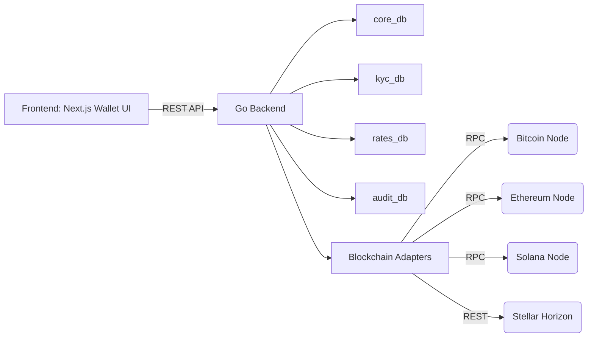

# 🧱 Crypto Wallet & Multi-Chain Exchange --- Tech Stack (Updated)

This is the **updated technical stack** for a Fintech-grade multi-chain
wallet system, now supporting **Bitcoin (BTC), Ethereum (ETH), Solana
(SOL), and Stellar (XLM)** --- built on **DDD + Hexagonal Architecture
(Hexagonal)** with 4 main databases.

---

## 🧭 1. Architecture Overview

---

Layer Tech / Pattern Description

---

**Architecture** DDD + Hexagonal Clear separation between
domain, application, and
infrastructure layers

**Backend Go (Golang 1.23+) Core backend system &
Language** blockchain interaction

**Frontend** Next.js 15 + TypeScript Modern web dashboard /
wallet UI

**Database** PostgreSQL 16 (4 DBs) core_db, kyc_db,
rates_db, audit_db

**Communication** REST API + JSON Between frontend ↔
backend

**Blockchain JSON-RPC / REST Between backend ↔
Access** blockchain nodes

**Deployment** Docker Compose + Makefile Easy local + production
orchestration

---

---

## 🧩 2. Backend (Golang)

---

Layer Folder Description

---

**Domain** `/internal/domain` Entities, value objects, and
repositories

**Application** `/internal/application` Use cases like CreateWallet,
SwapTokens, GetBalance

**Infrastructure** `/internal/infrastructure` Repositories, blockchain
adapters, encryption utils

**Interfaces** `/internal/interfaces/http` REST handlers, middleware,
authentication

**Config** `/configs` DB, chain registry,
environment variables

**Migrations** `/db/migrations` Schema and seed data for 4
databases

---

---

## 🔗 3. Blockchain Adapters (RPC + REST)

---

Chain Library / SDK Protocol Description

---

**Bitcoin [`btcsuite/btcd`](https://github.com/btcsuite/btcd), `btcutil` JSON-RPC Access Bitcoin
(BTC)** network via
BlockCypher or
self-node

**Ethereum [`go-ethereum`](https://github.com/ethereum/go-ethereum) JSON-RPC EVM-compatible RPC
(ETH)** client for ETH and
tokens

**Solana [`portto/solana-go-sdk`](https://github.com/portto/solana-go-sdk) JSON-RPC Access Solana
(SOL)** mainnet RPC for
balances and txs

**Stellar [`stellar/go`](https://github.com/stellar/go) REST Use Horizon REST
(XLM)** API for account and
transaction data

---

🧠 **Key concept:**\

- Frontend ↔ Backend → RESTful API (for UX, security, routing)\
- Backend ↔ Blockchain → RPC (node-level functions like `getBalance`,
  `sendRawTransaction`)

---

## 🪙 4. Token & Exchange Layer

---

Component Tech Description

---

**Token Registry** PostgreSQL Tables `chains` and `tokens`
(`core_db`) for multi-chain metadata

**Exchange Engine** Go service Performs off-chain swap
operations using trading
pairs

**Rates Provider** CoinGecko / Provides live crypto rates
Binance API

**Trading Pairs** PostgreSQL Table `trading_pairs` with
(`rates_db`) dynamic rate updates

**Future Integration** LayerZero / Optional for true cross-chain
Wormhole swapping
bridge

---

---

## 🧾 5. Database Layer (PostgreSQL x4)

---

Database Purpose Key Tables

---

**core_db** Core wallet and `users`, `wallets`,
ledger `transactions`, `chains`,
`tokens`, `ledger_entries`

**kyc_db** KYC & Compliance `kyc_profiles`,
`kyc_documents`,
`alert_rules`,
`user_risk_score`

**rates_db** Rates & Analytics `exchange_rates`,
`trading_pairs`,
`price_history`,
`transaction_summary`

**audit_db** Logging & Security `audit_logs`,
`security_logs`,
`api_audit`

---

---

## 🔒 6. Security & Cryptography

---

Purpose Library Description

---

**Key Encryption** `nacl/secretbox`, Encrypt private keys before
`crypto/aes-gcm` DB storage

**Password Hashing** `bcrypt` Secure user password
hashing

**Auth** `github.com/golang-jwt/jwt/v5` JWT-based authentication

**Transport HTTPS (Caddy/Nginx) TLS termination for API
Security** endpoints

**Audit Trail** PostgreSQL (`audit_db`) Immutable logging for all
critical actions

---

---

## 🪪 7. KYC & Compliance

Component Description

---

**KYC Providers** Integrate external API (Onfido / SumSub)
**AML Rules** JSON-based rule engine (`alert_rules`)
**Risk Scoring** Automated from `user_risk_score` table
**Encryption** AES-256 + data masking for PII
**Isolation** `kyc_db` separated from operational DBs

---

## 💻 8. Frontend (Next.js Wallet Dashboard)

---

Tech Description

---

**Next.js 15 (App Frontend framework for wallet and exchange UI
Router)**

**TypeScript** Type-safe development

**TailwindCSS + Modern UI components
ShadCN/UI**

**Framer Motion** Animated transitions

**Recharts** Analytics charts (balance, volume, rates)

**REST Client** `fetch()` / Axios for backend API calls

---

---

## 🐳 9. DevOps & Infrastructure

Tool Purpose

---

**Docker Compose** Orchestrate backend, DBs, and services
**Makefile** Common build and migration commands
**pgAdmin / TablePlus** Database visualization
**Prometheus + Grafana** System monitoring & metrics
**n8n / Cron Jobs** Background jobs (rate updates, syncs)
**Cloudflare Tunnel** Secure remote access to local API

---

## 📡 10. Communication Flow

---

## ✅ Summary

---

Category Stack

---

**Language** Go 1.23+, TypeScript
(Next.js)

**Databases** PostgreSQL × 4

**Blockchain SDKs** go-ethereum, btcsuite,
solana-go-sdk, stellar/go

**Security** AES-GCM, bcrypt, JWT, TLS

**Exchange Data** CoinGecko, Binance API

**Framework** DDD + Clean Architecture

**Infra** Docker Compose, Prometheus,
Grafana, n8n

**Supported Chains** Bitcoin, Ethereum, Solana,
Stellar

---

---
